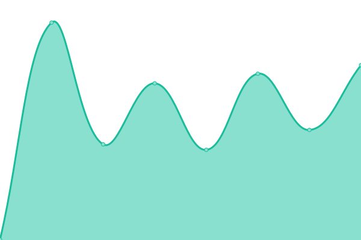
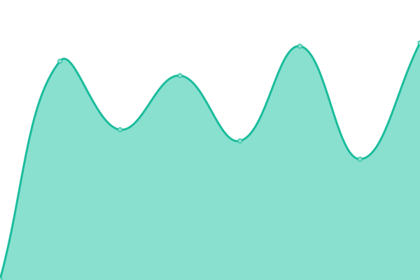

# [📈 Live Status](https://365taole.github.io/upptime): <!--live status--> **🟩 All systems operational**

This repository contains the open-source uptime monitor and status page for [王图思睿](https://365taole.github.io/upptime), powered by [Upptime](https://github.com/upptime/upptime).

With [Upptime](https://upptime.js.org), you can get your own unlimited and free uptime monitor and status page, powered entirely by a GitHub repository. We use [Issues](https://github.com/365taole/upptime/issues) as incident reports, [Actions](https://github.com/365taole/upptime/actions) as uptime monitors, and [Pages](https://365taole.github.io/upptime) for the status page.

<!--start: status pages-->
<!-- This summary is generated by Upptime (https://github.com/upptime/upptime) -->
<!-- Do not edit this manually, your changes will be overwritten -->
<!-- prettier-ignore -->
| URL | Status | History | Response Time | Uptime |
| --- | ------ | ------- | ------------- | ------ |
|  [19福利导航](https://19dh.space) | 🟩 Up | [19.yml](https://github.com/365taole/upptime/commits/HEAD/history/19.yml) | 

 663ms
     
 | 

<a href="https://365taole.github.io/upptime/history/19">100.00%</a>
    

|  [19福利导航_xyz](https://19dh.xyz) | 🟩 Up | [19-xyz.yml](https://github.com/365taole/upptime/commits/HEAD/history/19-xyz.yml) | 

 582ms
     
 | 

<a href="https://365taole.github.io/upptime/history/19-xyz">100.00%</a>
    

|  [19福利导航_main](https://19dh.vip) | 🟩 Up | [19-main.yml](https://github.com/365taole/upptime/commits/HEAD/history/19-main.yml) | 

 660ms
     
 | 

<a href="https://365taole.github.io/upptime/history/19-main">100.00%</a>
    

<!--end: status pages-->

[**Visit our status website →**](https://365taole.github.io/upptime)

## 📄 License

- Powered by: [Upptime](https://github.com/upptime/upptime)
- Code: [MIT](./LICENSE) © [王图思睿](https://365taole.github.io/upptime)
- Data in the `./history` directory: [Open Database License](https://opendatacommons.org/licenses/odbl/1-0/)
